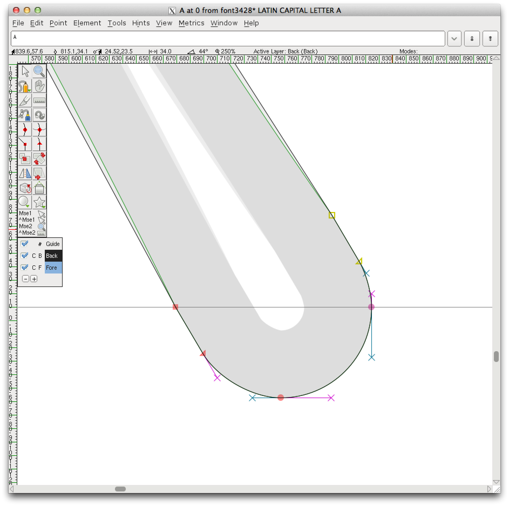

# inkscape-powerstroke-fonts

`0-simple-svg-font.svg` is a simple SVGFont file. 

`0-simple-svg-font-opened-ff-saved-as.ufo` is that file opened in FontForge and saved as a UFO, with some metrics set.

`1-simple-stroke-svg-font.svg` is a simple SVGFont file, with an `A` made using a PowerStroke LPE.

`1-simple-stroke-svg-font.ufo` is that file opened in FontForge and saved as a UFO.

Here is the SVG/UFO font opened in FontForge, showing the 'bulky' join of the stroke to the round terminal:

A new idea! `2-rect-as-advanceWidth.svg` is ready to become a simple SVGFont file, but it has `Rect` objects that can set the sidebearings. 
A proposed new python script could use the `Arrange` tools to create spacing text previews for a given string.
